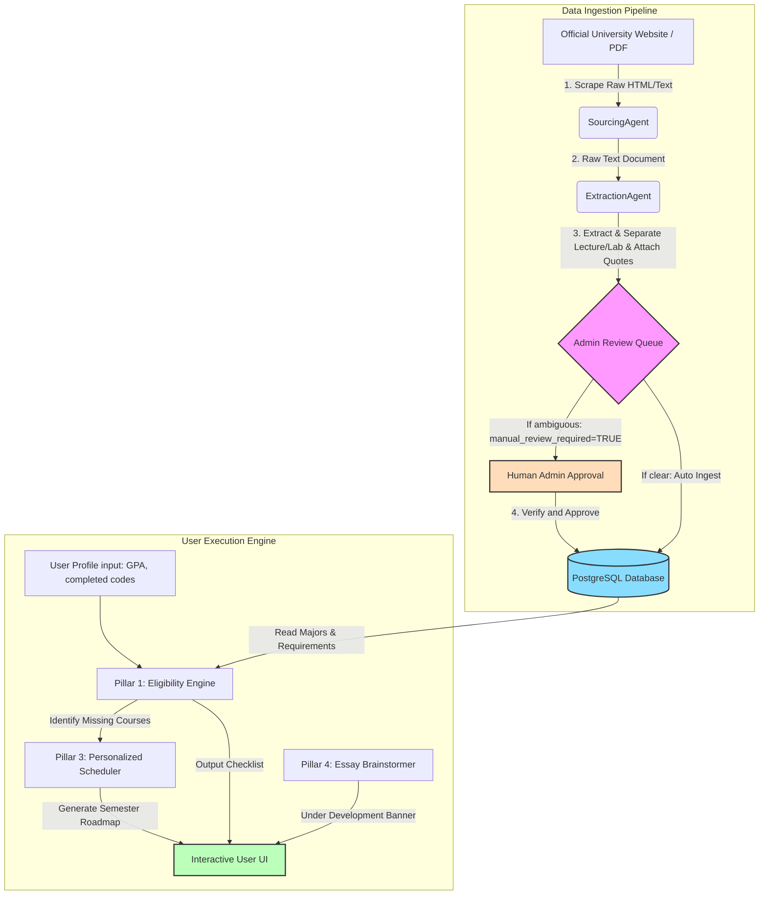

# Engineering Transfer Academic Strategy Engine - Architecture Document

본 문서는 **TRANSFERCHECK DATA FRAMEWORK v4** 규격을 준수하는 전체 시스템의 데이터 흐름, 에이전트 아키텍처 및 서비스 레이어를 정의합니다.

---

## 1. 시스템 데이터 흐름 (System Data Flow)

시스템은 데이터 획득(Scrape), 정제 및 정형화(Parse & Extract), 관리자 검증(Admin Review), 그리고 사용자 서비스 제공(UI Execution)의 4단계로 구성됩니다.

---

## 2. 레이어별 상세 설명 (Layer Descriptions)

### 2.1. Data Ingestion Pipeline (수집 파이프라인)
- **SourcingAgent**: 지정된 대학 입학처 및 전공 페이지의 데이터를 정기적으로 크롤링하거나 PDF 문서를 추출합니다.
- **ExtractionAgent**: LLM 및 정규식 룰을 조합하여 비정형 문서에서 편입 요구 조건을 추출합니다.
  - **Rule 2 (필수 상태 플래그)**: 필수 과목 여부를 분석하여 `required_for_eligibility = TRUE`로 설정합니다. 조건이 모호한 경우 `manual_review_required = TRUE`로 마크합니다.
  - **Rule 3 (렉처-랩 분리)**: `physics_1_lecture`와 `physics_1_lab`처럼 이론과 실험 과목을 개별 엔트리로 분리합니다.
  - **Rule 4 (출처 추적성)**: `official_source_quote`, `source_url`, `last_verified_date`를 포함하여 무결성을 검증합니다.
- **Admin Review Queue**: `manual_review_required = TRUE` 이거나 신규 유입된 정보는 관리자 승인 대기열에 진입하며, 최종 검증(`verified = TRUE`) 처리 후 실데이터베이스에 적재됩니다.

### 2.2. Core Database (PostgreSQL / Prisma)
- 데이터 모델은 `University`, `Major`, `EnglishRequirement`, `CourseRequirement`, `RawCourseMapping`으로 구성되어 있습니다.
- `RawCourseMapping` 테이블은 각 커뮤니티 칼리지나 일반 대학의 로컬 과목 코드(예: MATH 231)를 시스템 표준 과목명(예: calculus_1)으로 연결해 주는 중추 역할을 합니다.

### 2.3. User Execution Engine (매칭 및 스케줄러 코어)
- **Pillar 1: 지원 자격 판단 (Eligibility Engine)**:
  1. 사용자 프로필(GPA, 로컬 이수 과목 목록, 영어 점수)을 입력받습니다.
  2. 로컬 이수 과목을 표준 과목 코드로 매핑합니다.
  3. 지원 대학/전공의 필수 이수 목록과 대조하여 통과 여부 및 미충족 항목(Missing Courses)을 바이너리 형태로 추출합니다. (OR 그룹의 논리 조건도 함께 평가합니다)
- **Pillar 3: 맞춤형 스케줄러 (Personalized Scheduler)**:
  1. 미충족된 필수 과목들을 대상으로 표준 선수과목 맵(Prerequisite Map)을 적용합니다.
  2. 스케줄러는 각 과목이 미치는 영향력(Critical Path Depth, 해당 과목을 이수해야 뒤이어 들을 수 있는 과목들의 최대 경로 길이)을 계산하여 깊이가 깊은 과목(예: Calculus I)을 전반부에 우선 배정합니다.
  3. 학기당 최대 이수 과목 수(`maxCoursesPerSemester`)를 준수하면서 학기별 로드맵을 자동으로 배정합니다.

---

## 3. Pillar 4: AI 에세이 소스 추출 인터뷰 (AI Essay Brainstorming Interviewer)
현재 해당 기능은 개발 중(Under Development) 상태입니다. 
사용자 인터페이스(UI) 상에서 이 파트를 클릭하거나 진입하려고 할 시, 아래와 같은 안내 배너가 전면에 표시되어 혼선을 방지합니다:

> ### **아직 준비 중입니다 (Under Development)**
> 본 기능은 핵심 전공 자격 요건 판별 엔진 고도화 이후 순차적으로 오픈될 예정입니다.
