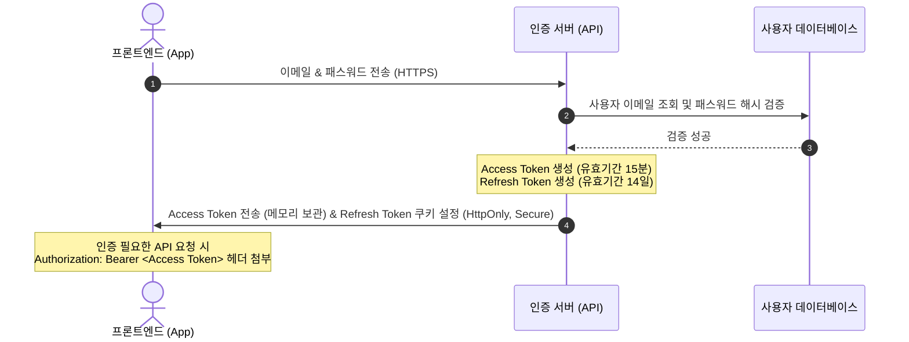
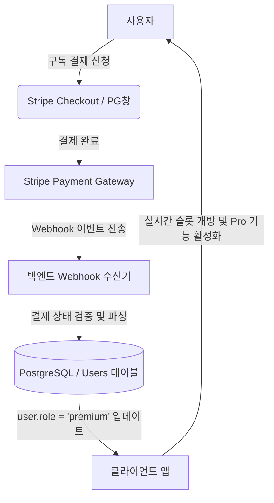

# Production-Grade Authentication & Storage Architecture Plan

본 문서는 현재 로컬 브라우저의 `localStorage` 기반 임시 인증 구조를 프로덕션 등급의 안전하고 신뢰할 수 있는 사용자 인증 및 데이터 동기화 아키텍처로 고도화하기 위한 설계안입니다.

---

## 1. 현재 데모 시스템 분석 및 취약점 진단

현재 구현되어 있는 가입/로그인 흐름은 다음과 같은 한계와 취약점을 가지고 있습니다:
* **XSS (Cross-Site Scripting) 취약성**: 사용자 계정 해시 데이터와 로그인 세션 정보가 `localStorage`에 평문으로 존재하므로, 타사 스크립트 삽입이나 악성 광고 스크립트 공격에 의해 토큰 및 가입 정보 전체가 손쉽게 탈취될 수 있습니다.
* **디바이스 간 동기화 불가능**: 로컬 저장소에 고정되므로 사용자가 모바일 브라우저나 다른 PC에서 로그인했을 때 입력했던 GPA, 이수 과목, 목표 슬롯 정보가 연동되지 않습니다.
* **클라이언트 사이드 검증의 위험**: 로그인 상태 변경 및 비밀번호 검증이 완전히 프론트엔드 JS 코드 단에서 처리되므로, 개발자 도구를 통한 스크립트 수정으로 인증을 손쉽게 우회할 수 있습니다.

---

## 2. 프로덕션 등급 권장 솔루션 (아키텍처 비교)

프로덕션 환경에서는 검증된 백엔드 또는 BaaS(Backend-as-a-Service) 플랫폼을 도입해야 합니다.

### Option A: Supabase (Recommended)
* **장점**: PostgreSQL 데이터베이스와 사용자 인증(GoTrue), RLS(Row Level Security)가 결합되어 있어, 추가적인 서버 코딩 없이 보안 규칙과 실시간 동기화를 구축할 수 있습니다.
* **보안성**: JWT 관리 및 OAuth2.0(Google, Apple, Github)이 기본 제공되며, 안전한 `HttpOnly` 쿠키 처리를 지원합니다.

### Option B: Node.js/Express + PostgreSQL + Redis (Self-Hosted)
* **장점**: 완전한 커스텀 컨트롤이 가능하며 인프라 종속성이 적습니다.
* **보안성**: 백엔드 서버에서 Bcrypt를 이용해 비밀번호를 솔팅(Salting) 후 해싱하며, 세션 식별자를 Redis에 안전하게 보관합니다.

---

## 3. 세부 보안 토큰 관리 설계

만약 자체 API 또는 Next.js 백엔드를 이용할 경우, 보안을 최대화하기 위해 **Dual Token (Access + Refresh)** 아키텍처를 설계합니다.

### 토큰 저장 위치 및 속성
1. **Access Token**: 클라이언트 메모리(State)에 임시 저장하여 브라우저 리로드 시 삭제되도록 합니다. XSS에 노출되더라도 유효기간이 매우 짧습니다(15분).
2. **Refresh Token**: 브라우저 JS가 읽을 수 없도록 **`HttpOnly`**, HTTPS 환경에서만 전송되도록 **`Secure`**, 동일 출처 요청에서만 전송되도록 **`SameSite=Strict`** 옵션이 적용된 쿠키에 저장합니다. CSRF와 XSS를 원천 차단합니다.

---

## 4. 유료 구독 및 결제 데이터 연동 설계

Monetization 기능 연동 시, 데이터베이스 사용자 고유 ID(`uid`)를 결제 PG사(Stripe, Toss 등)의 고객 ID(`customer_id`)와 안전하게 매핑해야 합니다.

* **Stripe Webhook**: 결제 주기 갱신(`customer.subscription.updated`), 구독 취소(`customer.subscription.deleted`), 결제 실패(`invoice.payment_failed`) 등의 상태 변화를 백엔드 웹훅 주소로 실시간 수신하여 DB의 회원 권한 필드(`role: 'free' | 'pro'`)에 즉시 반영합니다.
* **API 권한 게이트**: `/api/eligibility` 또는 `/api/roadmap` 요청 처리 시 백엔드 단에서 JWT의 사용자 권한을 검증하여, `role === 'pro'`가 아닌 상태에서 3개 이상의 전공 분석 또는 로드맵 배치 요청이 들어올 경우 요청을 차단(`403 Forbidden`)하여 오용을 방지합니다.
